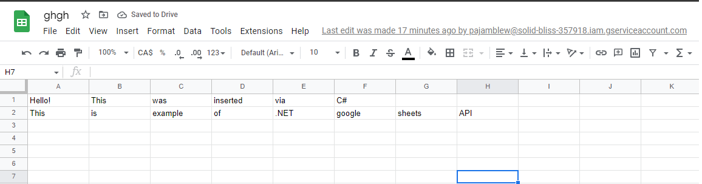

# GoogleSheets

This is a basic sample for reading and writing Google Sheets via C# .NET 6.0 and GoogleSheetsAPI.

## Usage

First, you need to create a Google Sheet via Google Sheets and generate the credentials for service account in Google Cloud Dashboard. Copy credentials.json to the \googlesheet\bin\Debug\net<version>\

Open the .sln file and paste your Google Sheet ID in to the ```spreadsheetId``` variable. Also, don't forget to check the name of your GoogleSheet in the ```sheet``` variable. You also need to give the permission for editing Google Sheet for your service account.

Finally, you can add your queries in ```Append request```.


## Example 

